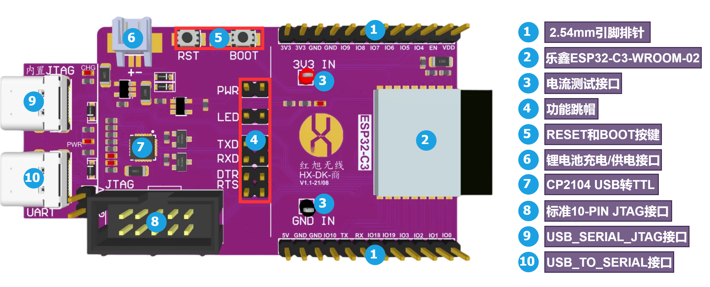

# ESP32-C3 BSP Introduction

[中文](README_ZH.md) | English

This document records the execution instruction of the BSP (board support package) for the [ESP32-C3](http://luatos.com/t/esp32c3) development board.

The document is covered in two parts:

- Board Resources Introduction
- Quickly Get Started

## Resources Introduction

We tested 2 development boards, it all works, but due to the different LED pins of the two development boards, so we'll need to select the corresponding development board in the menuconfig. 

- [LUATOS_ESP32C3](https://wiki.luatos.com/chips/esp32c3/board.html)


- [HX-DK-商](https://docs.wireless-tech.cn/doc/7/)



The mainly-used resources of LUATOS_ESP32C3 are shown as follows:

- MCU: [esp32-c3](https://www.espressif.com/sites/default/files/documentation/esp32-c3_datasheet_en.pdf)，Main Frequency 160MHz, 407.22 CoreMark; 2.55 CoreMark/MHz
- Built-in Chip: 384KB ROM, 400KB SRAM
- Peripherals
  - Red LED: 2, LED: D4 (IO12), D5（IO13）
  - Button: 2, K1（BOOT） K2(RST)
  - SPI FLASH: 4M
- Common-used interfaces: USB, UART, etc.

### For more details about this board, please refer to [Here](https://wiki.luatos.com/chips/esp32c3/board.html).

## **Peripheral Condition**

Each peripheral supporting condition for this BSP is as follows:

| **On-board Peripherals** | ****Support**** | ****Remark****                                               |
| ------------------------ | --------------- | ------------------------------------------------------------ |
| GPIO                     | Support         |                                                              |
| UART                     | Support         | Using LUATOS_ESP32C3 development board requires connecting serial port to USB chip UART0_TX and UART0_RX (such as CP2102) |
| JTAG debug               | Support         | ESP32C3 usb-linked development boards can be debugged        |

## Install ESP-IDF
ESP-IDF can be installed in two ways
1. Use Env tool
- Download the package
```
pkgs --update
```
- Install IDF tools. If you are using Linux or MacOS, go to ESP-IDF package directory and install IDF tools by running
```
cd packages/ESP-IDF-latest
./install.sh
```
If you are using Windows, open Command Prompt. Note that you cannot use any other terminals, such as the Env command line or PowerShell. Enter the BSP directory and run
```
install.bat
```
No matter what operating system you are using, this step only needs to be done once after the package is downloaded for the first time.
- Under the ESP-IDF package directory, export IDF environment variables. This commands need to be run every time when the BSP is built in a new terminal.
If you are using Linux or MacOS, run
```
. export.sh
```
If you are using Windows, run
```
export.bat
```
Same as the previous step, you can only use Command Prompt.

2. Apply patch to a local installation of ESP-IDF
- Select the below option with `SCons --menuconfig`
```
Hardware Drivers Config
    [*] Use local ESP-IDF installation
```
And deselect ESP-IDF package
```
RT-Thread online packages
    peripheral libraries and drivers
        [ ] ESP-IDF: Espressif IoT Development Framework
```
- Install FreeRTOS wrapper
```
pkgs --update
```
- Any convenient method to install ESP-IDF can be used, such as [VSCode plugin](https://github.com/espressif/vscode-esp-idf-extension/blob/master/docs/tutorial/install.md). Make sure to install the master version of ESP-IDF.
- Enter the local ESP-IDF directory and run the following commands
```
git checkout 5c1044d84d625219eafa18c24758d9f0e4006b2c
# Replace rtt.patch with the actual directory of rtt.patch under the BSP directory
git am rtt.patch
```
- After applying the patch, ESP-IDF FreeRTOS projects can be compiled as usual
## Compile and Upload
- Configure RT-Thread under the BSP directory
```
scons --menuconfig
```
- Whenever RT-Thread configuration is changed with `scons --menuconfig`, a new `CMakeLists.txt` needs to be generated with the command below
```
scons --target=esp-idf
```
- If ESP-IDf is installed using Env, use `idf.py` to compile and upload the program. Refer to [Espressif official documents](https://docs.espressif.com/projects/esp-idf/en/latest/esp32c3/get-started/index.html#build-your-first-project) for reference. Note if you are using Windows, you can only use `idf.py` commands in Windows Command Prompt. Otherwise follow the appropriate steps depending on how ESP-IDF was installed, such as using [VSCode plugin](https://github.com/espressif/vscode-esp-idf-extension/blob/master/docs/tutorial/install.md). 
- Once the project is successfully downloaded, the system runs automatically, the red LED will blink in 1s on cycles.

## Notes

- The basic functions are now supported, but it needs more, welcome any contributions and feedback. 


Maintainer: 

- [supperthomas](https://github.com/supperthomas) email address: [78900636@qq.com](mailto:78900636@qq.com)
-  [tangzz98](https://github.com/tangzz98) email address: [tangz98@outlook.com](tangz98@outlook.com)

Special thanks to [chenyingchun0312](https://github.com/chenyingchun0312) for providing support on the RISC-V part working.

