# HIFIVE1 #

## 简介

[HIFIVE1](https://www.sifive.com/products/hifive1/) 是由 SiFive 公司推出的全球首款基于开源指令集 RISC-V 架构的商用 SoC Freedom E310 的开发板。

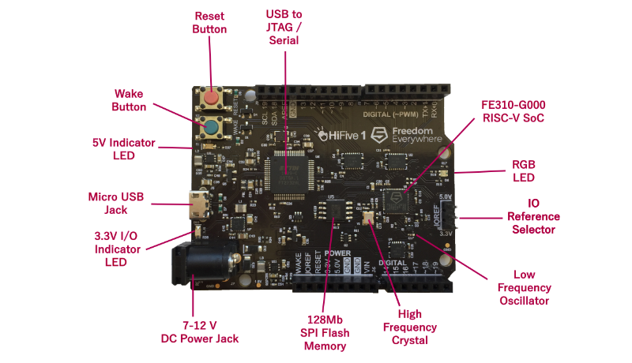


### 板载资源：

| 硬件 | 描述 |
| -- | -- |
|Soc| SiFive Freedom E310 (FE310) |
| 内核    | SiFive E31 RISC-V Core                                      |
| 架构       |  32-bit RV32IMAC                                         |
| 主频       | 320+ MHz                                              |
| 性能 | 1.61 DMIPs/MHz, 2.73 Coremark/MHz            |
|SRAM| 16KB |
|Flash| 16MB QSPI + 16KB 指令Cache |

## 编译说明

### 下载 Freedom Studio

Freedom Studio 是 SiFive 公司推出的一个集成开发环境，用来编写和调试基于 SiFive 处理器的软件。内嵌了编译好的 RISC-V GCC 工具链、OpenOCD、以及一些示例和文档。

下载地址：[官网下载](https://www.sifive.com/products/tools/)

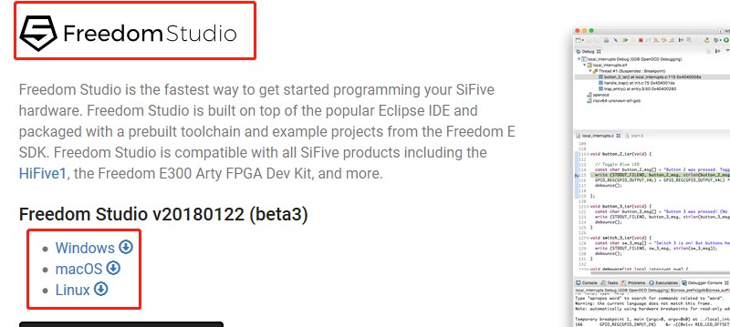

下载成功之后，解压到和 rt-thread 源码同一目录下


### 配置工具链

工具链就在解压开的 IDE  `F:\FreedomStudio\SiFive\riscv64-unknown-elf-gcc-20171231-x86_64-w64-mingw32\bin` 目录下。

在源码  `rt-thread/bsp/hifive1/` 目录下，运行 env 工具，输入下面的命令设置 gcc 工具链路径

```
set RTT_EXEC_PATH=F:\FreedomStudio\SiFive\riscv64-unknown-elf-gcc-20171231-x86_64-w64-mingw32\bin
```

或者通过`scons --exec-path="GCC工具链路径"`命令，在指定工具链位置的同时直接编译。

### 添加环境变量

将 **工具链**和**编译工具**的路径 添加到环境变量里，输入命令如下

```
set path=%path%;工具链的路径;编译工具的路径;
```

例如：

```
set path=%path%;F:\FreedomStudio\SiFive\riscv64-unknown-elf-gcc-20171231-x86_64-w64-mingw32\bin;F:\FreedomStudio\build-tools\bin
```


### 从 env 工具打开 IDE

利用 cd 命令，切换到解压开的 IDE 目录


输入 Freedom Studio 按 Tab 键 自动补全，然后按回车运行 IDE。


在弹出的窗口输入 workspace 创建工作空间，然后点击启动打开 IDE。

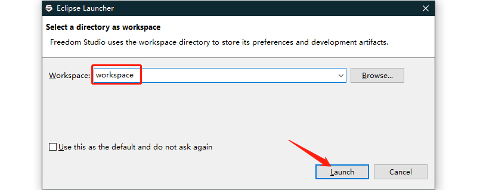

### 导入工程

在菜单栏点击 `File->Import` 

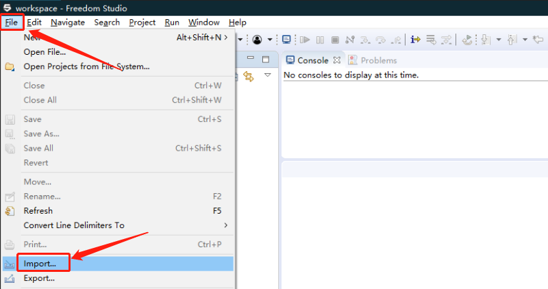

按照下面的图片导入工程

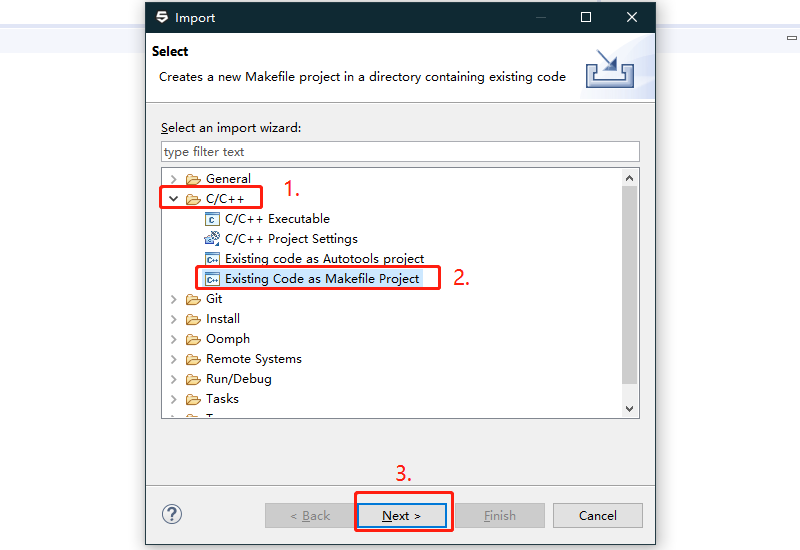

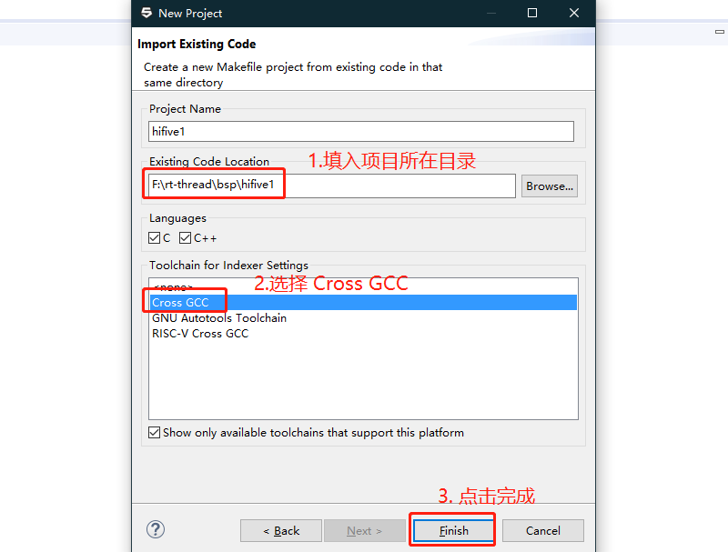


### 编译


然后等待编译完成


## 烧写及执行

### 安装驱动

1. 使用 Micro USB 线连接电脑和开发板。

2. 然后双击安装 IDE 目录 `F:\FreedomStudio\SiFive\Drivers` 下的驱动文件

### 添加字符串定义

点击菜单栏 `Window->preferences`  按下图的步骤将 字符串 `cross_prefix` 定义为 `riscv64-unknown-elf-`

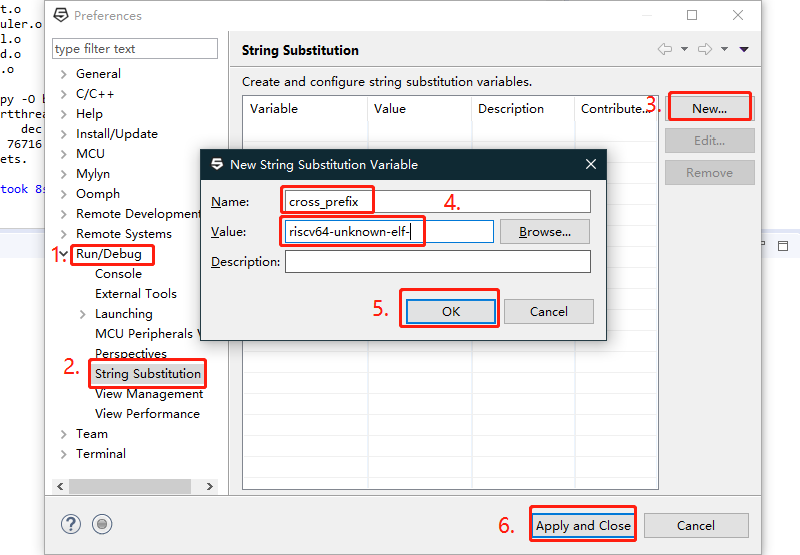

### 配置 Debug 参数

选中生成的 `rtthread.elf` 文件,右键配置 Debug 参数，如下图所示

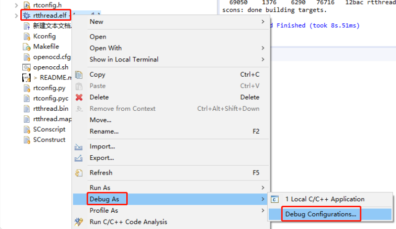

按下图新建一个 Debug 选项


打开 `Debugger` 选项卡 添加如下参数

```
-f openocd.cfg

set mem inaccessible-by-default off
set arch riscv:rv32
set remotetimeout 250
```

如下图所示：

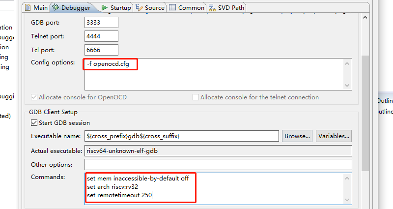

打开 `startup` 选项卡，去掉**主机模式**和**复位命令**

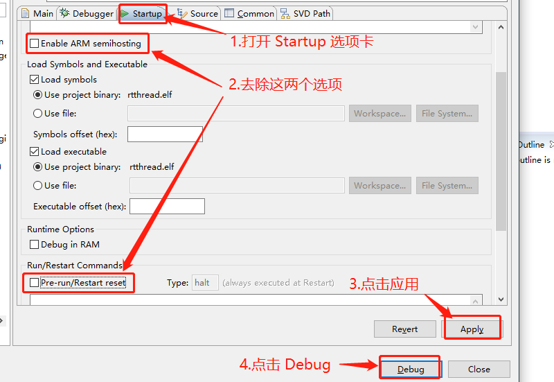

然后待程序停止在 main 函数处，然后点击继续运行程序就运行起来了。

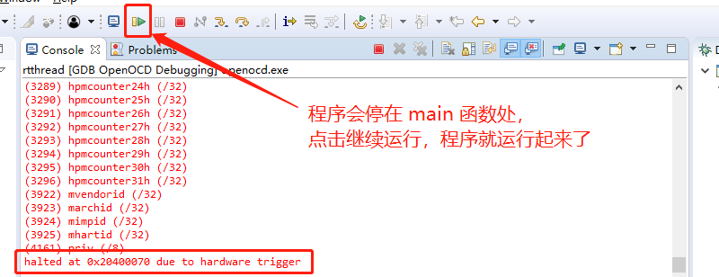

### 运行结果

下载程序之后，连接串口(115200-N-8-1)，可以看到RT-Thread的输出信息：

```
 \ | /
- RT -     Thread Operating System
 / | \     3.0.4 build May 30 2018
 2006 - 2018 Copyright by rt-thread team
msh >
```

## 4. 驱动支持情况及计划

| 驱动 | 支持情况  |  备注  |
| ------ | ----  | :------:  |
| UART | 支持 | UART0_RX/TX：GPIO 16/17 |


### 4.1 IO在板级支持包中的映射情况

| IO号 | 板级包中的定义 |
| -- | -- |
| GPIO19 | LED_GREEN |
| GPIO21 | LED_BLUE |
| GPIO22 | LED_RED |

## 5. 联系人信息

维护人：
- [tanek](https://github.com/TanekLiang)

## 6. 参考

* [HIFIVE1 Info](https://www.sifive.com/products/hifive1/)
* [HIFIVE1 Software Development Tools](https://www.sifive.com/products/tools/)
* [hifive1-getting-started-guide](https://www.sifive.com/documentation/boards/hifive1/hifive1-getting-started-guide/)
* [hifive1-schematics](https://www.sifive.com/documentation/boards/hifive1/hifive1-schematics/)
