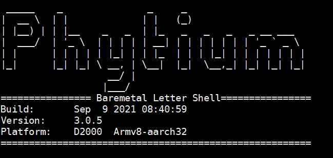
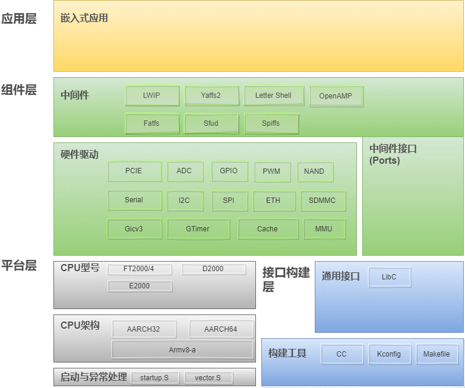
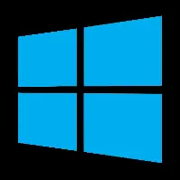
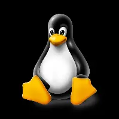

# Phytium-Standalone-SDK

**v0.3.1** [ReleaseNote](./doc/ChangeLog.md)

## 1. 项目概要

### 1.1 基本介绍

本项目发布了 Phytium 系列 CPU 的 嵌入式软件开发工具包，包括板级支持包、第三方开源中间件、交叉编译构建工具、及其 Baremetal 参考例程，在支持多平台裸机应用开发的基础上，能够为多种RTOS提供外设驱动和配置构建工具。




### 1.2 系统架构


本项目的整体设计如下所示，自下而上可以分为平台层、组件层、框架层和应用层。



- 平台层（Platform）在整个软件框架中位于最底层，提供了基本数据结构类型定义、驱动参数标定、硬件平台耦合的寄存器自检、板级启动、CPU 内存虚拟等功能

- 组件层（Component）在整个软件框架中位于中间位置，向下依赖于平台层提供的参数配置与内存方案，向上提供应用开发与模块测试的支持

- 框架层（Framework）为开发主机提供了开发环境，支持SDK安装，应用工程配置和二进制文件构建及烧录等工具。

- 应用层（Application）提供了应用开发模板和例程，帮助开发者迅速熟悉SDK的使用，进行不同类型的应用程序开发

### 1.3. 源代码结构

```
.
├── Kconfig               --> 配置定义
├── LICENSE               --> 版权声明
├── README.md             --> 使用说明
├── arch                  
│   └── armv8             --> 架构相关
├── baremetal
│   └── example           --> 裸机例程
├── board                  
│   ├── d2000
│   ├── e2000
│   └── ft2004            --> 平台相关
├── common                
│   ├── fprintf.c
│   ├── fprintf.h
│   ├── fsleep.c
│   └── fsleep.h          --> 通用方法
├── configs
│   ├── ft2004_aarch32_defconfig
│   └── ft2004_aarch64_defconfig  --> 各平台默认配置
├── doc
│   ├── ChangeLog.md      --> 修改记录
│   └── reference         --> 接口说明文档
├── drivers
│   ├── can
│   ├── dma
│   └── watchdog          --> 外设驱动
├── install.py            --> 安装脚本
├── lib             
│   ├── Kconfiglib
│   ├── lib.mk
│   ├── libc
│   └── nostdlib          --> 依赖库
├── make
│   ├── build_baremetal.mk
│   ├── buildinfo.mk
│   ├── complier.mk
│   └── preconfig.mk      --> 编译脚本和链接脚本
├── requirements.txt      --> python环境依赖组件
├── scripts
├── standalone.mk
├── third-party
│   └── letter-shell-3.1  --> 第三方库            
├── tools
```

---

## 2. 快速入门

- 目前支持在Windows和Linux上使用SDK，支持在x86_64和ARM AARCH64设备上完成交叉编译




- 参考[Windows10 快速入门](./doc/reference/usr/install_windows.md), [Linux x86_64 快速入门](./doc/reference/usr/install_linux_x86_64.md)

- 参考[使用说明](./doc/reference/usr/usage.md), 新建Phytium Standalone SDK的应用工程，与开发板建立连接

- 参考[例程](./baremetal/example)，开始使用SDK

---

## 3. 硬件参考

### 3.1 FT2000-4

FT-2000/4 是一款面向桌面应用的高性能通用 4 核处理器。每 2 个核构成 1 个处理器核簇（Cluster），并共享 L2 Cache。主要技术特征如下：

- 兼容 ARM v8 64 位指令系统，兼容 32 位指令
- 支持单精度、双精度浮点运算指令
- 支持 ASIMD 处理指令
- 集成 2 个 DDR4 通道，可对 DDR 存储数据进行实时加密
- 集成 34 Lane PCIE3.0 接口：2 个 X16（每个可拆分成 2 个 X8），2 个 X1
- 集成 2 个 GMAC，RGMII 接口，支持 10/100/1000 自适应
- 集成 1 个 SD 卡控制器，兼容 SD 2.0 规范
- 集成 1 个 HDAudio，支持音频输出，可同时支持最多 4 个 Codec
- 集成 SM2、SM3、SM4 模块
- 集成 4 个 UART，1 个 LPC，32 个 GPIO，4 个 I2C，1 个 QSPI，2 个通 用 SPI，2 个 WDT，16 个外部中断（和 GPIO 共用 IO）
- 集成温度传感器

### 3.2 D2000

D2000 是一款面向桌面应用的高性能通用 8 核处理器。每 2 个核构成 1 个处理器核簇（Cluster），并共享 L2 Cache。存储系统包含 Cache 子系统和 DDR，I/O 系统包含 PCIe、高速 IO 子系统、千兆位以太网 GMAC 和低速 IO 子系统，主要技术特征如下，

- 兼容 ARM v8 64 位指令系统，兼容 32 位指令
- 支持单精度、双精度浮点运算指令
- 支持 ASIMD 处理指令
- 集成 2 个 DDR 通道，支持 DDR4 和 LPDDR4，可对 DDR 存储数据进行实时加密
- 集成 34 Lane PCIE3.0 接口：2 个 X16（每个可拆分成 2 个 X8），2 个 X1
- 集成 2 个 GMAC，RGMII 接口，支持 10/100/1000 自适应
- 集成 1 个 SD 卡控制器，兼容 SD 2.0 规范
- 集成 1 个 HDAudio，支持音频输出，可同时支持最多 4 个 Codec
- 集成 SM2、SM3、SM4、SM9 模块
- 集成 4 个 UART，1 个 LPC，32 个 GPIO，4 个 I2C，1 个 QSPI，2 个通用 SPI，2 个 WDT，16 个外部中断（和 GPIO 共用 IO）
- 集成 2 个温度传感器


### 3.3 E2000D

- E2000D 1个cluster有2个cpu，共两核。主要技术特征如下：

- 兼容ARM v8 64 位指令系统，兼容32 位指令
- 支持单精度、双精度浮点运算指令
- L1有32KB，L2有256KB
- 集成1个DDR4 通道，可对DDR 存储数据进行实时加密
- 集成4 Lane PCIE3.0 接口（4X1）
- 集成网络接口4x1000M SGMII，1路支持RGMII/RMII，支持1路TSN
- 集成2个USB2.0(OTG)接口
- 集成1个HDAudio，支持音频输出;2路DP显示接口
- 集成2路SATA3.0模块
- 集成常用低速接口：WDT，DMAC，QSPI，PWM，Nand，SD/SDIO/eMMC ，SPI_M，UART，I2C，MIO，CAN， LPC_M_S，GPIO，LBC，Timer

### 3.4 E2000S

- E2000S 1个cluster有1个cpu，单核结构。主要技术特征如下：

- 兼容ARM v8 64 位指令系统，兼容32 位指令
- 支持单精度、双精度浮点运算指令
- L1有32KB，L2有256KB
- 集成1个DDR4 通道，可对DDR 存储数据进行实时加密
- 集成2 Lane PCIE3.0 接口（2X1）
- 集成网络接口2x1000M SGMII/RGMII/RMII，支持2路NCSI
- 集成2个USB2.0(OTG)接口
- 集成1个HDAudio，支持音频输出;2路DP显示接口
- 集成JPEG Encoder模块
- 集成常用低速接口：WDT，DMAC，PWM，QSPI，SD/SDIO/eMMC，SPI_M，UART，I2C，MIO，I3C，PMBUS， LPC_M_S，GPIO，oneWire，Timer


## 4 外设驱动支持情况

| Hardware Interface             | Platform Supported         | Platform Developing         | Component                 |
| ------------------------------ | -------------------------- | --------------------------- | ------------------------- |
| Generic Intrrupt Controller v3 | FT2000/4<br>E2000<br>D2000 |                             | gic/fgic                  |
| Generic Timer                  | FT2000/4<br>E2000<br>D2000 |                             | generic_timer             |
| UART (PrimeCell PL011)         | FT2000/4<br>E2000<br>D2000 |                             | usart/pl011_uart          |
| 10/100/1000MB-ETHERNET         | FT2000/4<br>E2000<br>D2000 |                             | eth/fgmac<br>eth/fxmac    |
| ADC                            | E2000                      |                             | adc/fadc                  |
| CAN                            | FT2000/4<br>E2000<br>D2000 |                             | can/fcan                  |
| DDMA                           |                            | E2000                       | dma/fddma                 |
| GDMA                           | E2000                      |                             | dma/gdma                  |
| GPIO                           | FT2000/4<br>E2000<br>D2000 |                             | gpio/fgpio                |
| I2C                            | FT2000/4<br>E2000<br>D2000 |                             | i2c/fi2c                  |
| QSPI (Nor Flash)               | FT2000/4<br>E2000<br>D2000 |                             | qspi/fqspi                |
| SPI                            | FT2000/4<br>E2000<br>D2000 |                             | spi/fspim                 |
| TIMER & TACHO                  | E2000                      |                             | timer/ftimer_tacho        |
| MIO                            | E2000                      |                             | mio/fmio                  |
| SDMMC                          |                            | FT2000/4<br>D2000           | mmc/fsdmmc                |
| SDIO                           | E2000                      |                             | mmc/fsdio                 |
| PCIE                           | FT2000/4<br>D2000<br>E2000 |                             | pcie/fpcie                |
| NAND                           | E2000                      |                             | nand/fnand                |
| RTC                            | FT2000/4<br>D2000          |                             | rtc/frtc                  |
| SATA                           | FT2000/4<br>D2000<br>E2000 |                             | sata/fsata                |
| USB-PCI                        |                            | FT2000/4<br>E2000<br>D2000  | usb/fxhci                 |
| PWM                            | E2000                      |                             | pwm/fpwm                  |
| WDT                            | FT2000/4<br>D2000<br>E2000 |                             | watchdog/fwdt             |


| Third-Party                    | Platform Supported         | Platform Developing         | Component                 |
| ------------------------------ | -------------------------- | --------------------------- | ------------------------- |
| LWIP 2.1.2                     | FT2000/4<br>D2000<br>E2000 |                             | lwip-2.1.2                |
| Letter shell 3.1               | FT2000/4<br>D2000<br>E2000 |                             | letter-shell-3.1          |
| Sdmmc                          | FT2000/4<br>D2000          |                             | sdmmc                     |
| Sfud 1.1.0                     | FT2000/4<br>D2000<br>E2000 |                             | sfud-1.1.0                |
| Backtrace                      | FT2000/4<br>D2000<br>E2000 |                             | backtrace                 |
| Tlsf                           | FT2000/4<br>D2000<br>E2000 |                             | tlsf-3.1.0                |
| Fatfs (RAM/Sd/SATA)            | FT2000/4<br>D2000<br>E2000 |                             | fatfs-0.1.3               |
| Ymodem                         | FT2000/4<br>D2000<br>E2000 |                             |                           |
| OpenAMP                        | FT2000/4<br>D2000<br>E2000 |                             | openamp                   |
| LittleFS-2.4.2                 |                            | FT2000/4<br>E2000<br>D2000  | littlefs-2.4.2            |
| SPIFFS-0.3.7                   | FT2000/4<br>D2000<br>E2000 |                             | spiffs-0.3.7              |

---

## 5. API指南

### 5.1 DRIVERS

#### 5.1.1 [FI2C](./doc/reference/driver/fi2c.md)

#### 5.1.2 [FPL011](./doc/reference/driver/fpl011.md)

#### 5.1.3 [FRTC](./doc/reference/driver/frtc.md)

#### 5.1.4 [FWDT](./doc/reference/driver/fwdt.md)

#### 5.1.5 [FSPIM](./doc/reference/driver/fspim.md)

#### 5.1.6 [FQSPI](./doc/reference/driver/fqspi.md)

#### 5.1.7 [FSDMMC](./doc/reference/driver/fsdmmc.md)

#### 5.1.8 [FSATA](./doc/reference/driver/fsata.md)

#### 5.1.9 [FPCIE](./doc/reference/driver/fpcie.md)

#### 5.1.10 [FUSB](./doc/reference/driver/fusb.md)

#### 5.1.11 [FGPIO](./doc/reference/driver/fgpio.md)

#### 5.1.12 [FGIC](./doc/reference/driver/fgic.md)

#### 5.1.13 [FDDMA](./doc/reference/driver/fddma.md)

#### 5.1.14 [FCAN](./doc/reference/driver/fcan.md)

#### 5.1.15 [FADC](./doc/reference/driver/fadc.md)

#### 5.1.16 [FPWM](./doc/reference/driver/fpwm.md)

#### 5.1.17 [FSDIO](./doc/reference/driver/fsdio.md)

### 5.2 MEMORY
#### 5.2.1 [FMEMORY_POOL](./doc/reference/sdk/fmemory_pool.md)

### 5.3 CPU

#### 5.3.1 [MMU](./doc/reference/processor/mmu.md)

#### 5.3.2 [FPINCTRL](./doc/reference/sdk/fpinctrl.md)

#### 5.3.2 [INTERRUPT](./doc/reference/processor/interrupt.md)

---

## 6. 贡献方法

请联系飞腾嵌入式软件部

huanghe@phytium.com.cn

zhugengyu@phytium.com.cn

wangxiaodong1030@phytium.com.cn

liushengming1118@phytium.com.cn


---

## 6. 相关资源


- ARM Architecture Reference Manual
- ARM Cortex-A Series Programmer’s Guide
- Programmer Guide for ARMv8-A
- ARM System Developers Guide Designing and Optimizing System Software
- FT-2000／4 软件编程手册-V1.4
- D2000 软件编程手册-V1.0
- Bare-metal programming for ARM —— A hands-on guide
- Using the GNU Compiler Collection
- Using ld, The GNU Linker
- Using as, The GNU Assembler
- Armv8-A memory model guide

---

## 7. 许可协议

Phytium Public License 1.0 (PPL-1.0)
