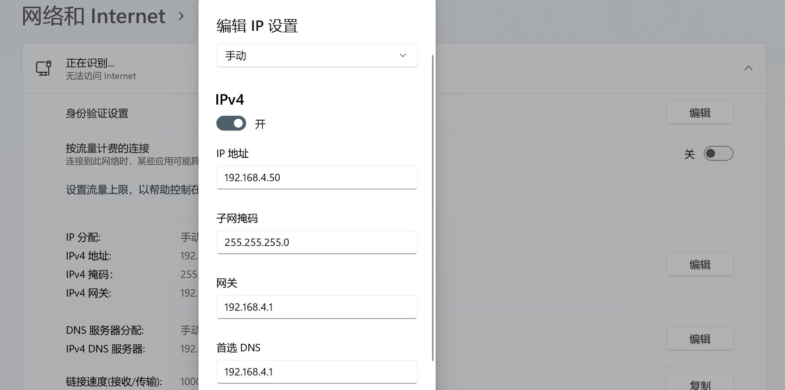
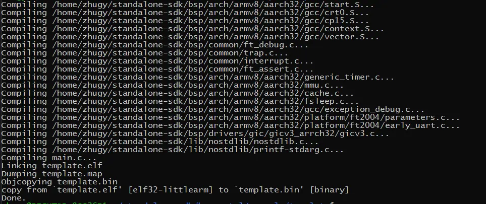

# 使用方法
## 1.1前期配置
在正式调用SDK实例前，需要对tftp进行一系列配置，Windows下与Linux下的方法有很大的区别，下面我们正式开始
>对于权限不够的问题，普通用户可以在指令前加上`sudo`来暂时获得root权限

### 1.1.1 在 host 侧（Ubuntu 20.04）配置 tftp 服务

- 在开发环境`host`侧安装`tftp`服务

```
sudo apt-get install tftp-hpa tftpd-hpa
sudo apt-get install xinetd
```

- 新建 `tftboot`目录, `/mnt/d/tftboot`, 此目录应与项目编译脚本makefile中的USR_BOOT_DIR一致, 并确保 tftboot 目录有执行权限`chmod 777 /**/tftboot`

- 配置主机 tftpboot 服务, 新建并配置文件`/etc/xinetd.d/tftp`

```
# /etc/xinetd.d/tftp

server tftp
{
  socket_type = dgram
  protocol = udp
  wait = yes
  user = root
  server =  /usr/sbin/in.tftpd
  server_args = -s /mnt/d/tftboot
  disable = no
  per_source = 11
  cps = 100 2
  flags = IPv4
}
```
---
在配置上述文件时，如果之前没有使用过Linux文件编写，可以使用自带的vim编辑器
```
vim /etc/xinetd.d/tftp
```
---
- 启动主机`tftp`服务，生成默认配置

```
$ sudo service tftpd-hpa start
```

- 修改主机`tftp`配置，指向`tftboot`目录
  修改/etc/default/tftpd-hpa
```
vim /etc/default/tftpd-hpa
```

```
$ sudo vim /etc/default/tftpd-hpa
# /etc/default/tftpd-hpa

TFTP_USERNAME="tftp"
TFTP_DIRECTORY="/mnt/d/tftboot"
TFTP_ADDRESS=":69"
TFTP_OPTIONS="-l -c -s"
```

- 重启主机`tftp`服务

```
$ sudo service tftpd-hpa restart
```
>注意，每次进入Linux系统时都需要使用该代码重启主机`tftp`服务
- 测试主机`tftp`服务的可用性
登录`tftp`服务，获取`tftboot`目录下的一个文件

```
$ tftp 192.168.4.50
tftp> get test1234
tftp> q
```

### 1.1.2 在 host 侧（Windows）配置 tftp 服务

- 将`tftp.zip`解压到开发环境，如`D:\**\phytium-dev-windows-nt\tftp`
  >如果`phytium-dev-windows-nt\tftp`已经存在，则直接进行下一步
- 以**管理员权限**打开Windows cmd，进入`D:\**\phytium-dev-windows-nt\tftp`，运行`.\reinstall.cmd`完成Tftpd服务安装


  >注意每次使用前，都需要进入Windows服务，手动将tftp服务打开

### 1.1.3 配置以太网ipv4设置
- 为了连接串口，打开windows下的以太网设置界面，选择手动设置，配置相关地址


## 1.2 连接开发板，着手跑通用例
- 在完成前面的步骤后，就可以着手连接开发板。连接之前，需要下载Windows下与的开发板配套软件
[MobaXterm_Portable_v22.0](https://pan.baidu.com/s/1IjDG2j5YwK9IhpBR4ChoYA   )
  >提取码：ROOT

- 如果是不用内置Linux子系统的windows用户还需要在`tftp`中配置。配置完成后，进入SDK，双击`D:\phytium-dev\phytium-standalone-sdk`目录下的`run_tftd.cmd`，启动tftp工具，设置tftp目录和ip


### 1.2.1 编译获取.elf与.bin文件
以WSL为例:
- 进入SDK所在目录，右键打开Windows终端，输入以下指令
  ```
  wsl
  ```
  
- 进入`baremetal`文件夹，选取一个希望执行的用例。以`uart测试`为例，在wsl下输入如下指令，进入测试用例所在文件夹
  ```
  cd baremetal/example/peripheral/serial/fpl011_test
  ```
- 根据需求，配置在不同芯片下32位或64位的编译模式，这里以`飞腾新四核芯片`的32位为例，输入以下指令
  ```
  make load_ft2004_aarch32 
  ```
- 编译测试用例，输入以下指令
  ```
   make clean boot
  ```
- 出现如下信息，表示编译成功，编译结果.elf与.bin文件已经保存至tftboot文件夹内


### 1.2.2 配置开发板ip，连通host下载启动镜像
- 连通开发板串口，打开windows的设备管理器，在端口栏确认串口是否成果接入


- 打开MobaXterm_Portable软件，选择`Session`，然后选择`Serial`，选择串口（如上图所示串口号为`COM3`），设置波特率`bps`为115200

- 进入`u-boot`界面，输入如下指令，配置开发板ip，`host`侧ip和网关地址
  ```
  setenv ipaddr 192.168.4.20  
  setenv serverip 192.168.4.50 
  setenv gatewayip 192.168.4.1 
  ```
- 随后烧录`tftboot`文件夹下的文件到开发板，输入以下指令
  ```
  tftpboot 0x90100000 baremetal.elf
  bootelf -p 0x90100000
  ```

  > 镜像启动的地址为`0x80100000`, 对于`BIN`文件，需要直接加载到`0x80100000`，对于`ELF`文件，启动地址会自动获取，需要加载到`DRAM`中一段可用的地址，这里选择`0x90100000`

- 见到如下结果，表示成功进入测试环境，可以自行浏览每个测试用例文件夹下对应的`README.md`文件，根据其中的提示，进行用例调试

  
<!-- 支持使用以下几种方式跳转启动
- 1. `AARCH32/AARCH64`支持加载`BIN`文件到启动地址，刷新缓存后，通过`go`命令跳转启动

```
# tftpboot 0x80100000 baremetal.bin
# dcache flush
# go 0x80100000
```

- 2. `AARCH32/AARCH64`支持加载`ELF`文件到`DRAM`，通过`bootelf`解析跳转启动

```
# tftpboot 0x90100000 baremetal.elf
# bootelf -p 0x90100000
```

 -->


<!-- 

- 进入SDK，双击`D:\phytium-dev\phytium-standalone-sdk`目录下的`run_tftd.cmd`，启动tftp工具，设置tftp目录和ip


- 将镜像文件放置在上图所示的`%PHYTIUM_IDE_PATH%\tftp`目录下，开发板即可通过`tftpboot`加载镜像

> 在`template_mingw64`工程中，通过定义`USR_BOOT_DIR`可以将编译的镜像自动拷贝带tftp目录下 -->
## 1.3 新建一个baremetal应用工程
如果您希望自己建立一个应用工程，可以参考下面的流程
### 1.3.1 选择工程模板

- 复制`~/standalone-sdk/example/template`目录，作为 baremetal 应用工程

  > `*` 表示可选文件/目录
  ```
  $ ls
  Kconfig       --> 应用工程配置menu文件
  makefile      --> makefile
  main.c        --> 包含main函数
  sdkconfig     --> 配置输出
  sdkconfig.h   --> 配置输出
  inc           --> 用户头文件*
  src           --> 用户源文件*
  ```
  >请注意使用小写makefile，使用Makefile在部分平台不能被识别

### 1.3.2 选择目标平台

- 切换目标平台, e.g `FT2000/4 AARCH32`, 加载默认配置

  ```
  make config_ft2004_aarch32
  ```

  > 使用`FT2000-4`作为目标编译平台，通过`make config_ft2004_aarch32`和`make config_ft2004_aarch64`加载默认配置

  > 使用`D2000`作为目标编译平台，通过`make config_d2000_aarch32`和`make config_d2000_aarch64`加载默认配置

- 编译应用工程, 生成`*.bin`文件用于下载到开发板
  ```
  $ make
  $ ls
  template.bin   --> 二进制文件
  template.dis   --> 反汇编文件
  template.elf   --> ELF文件
  template.map   --> 内存布局文件
  ```
  

### 1.3.3 快速使用例程

- 将`BIN`文件或者`ELF`文件复制到`tftpboot`目录
  ```
  $ cp ./baremetal.bin /mnt/d/tftboot
  $ cp ./baremetal.elf /mnt/d/tftboot
  ```
  > ~/standalone-sdk/example/aarch32_hello_world
  
- 结合1.2节中的操作，即可快速使用自己创建的例程